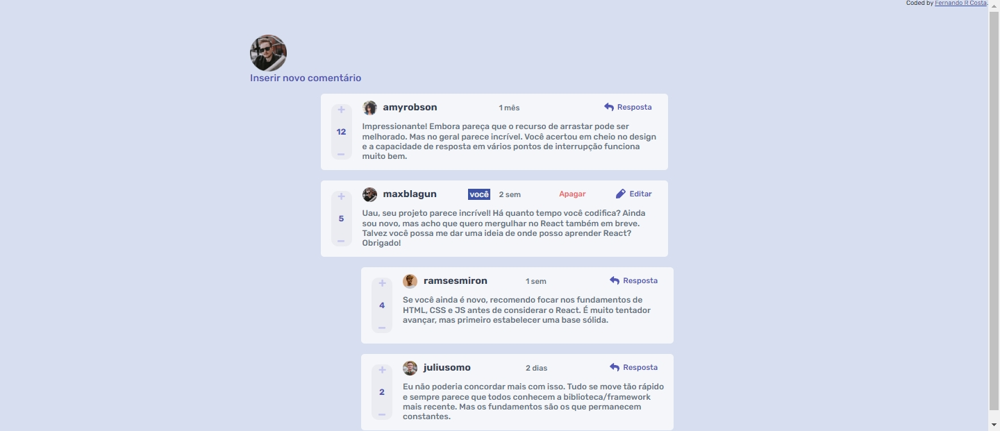
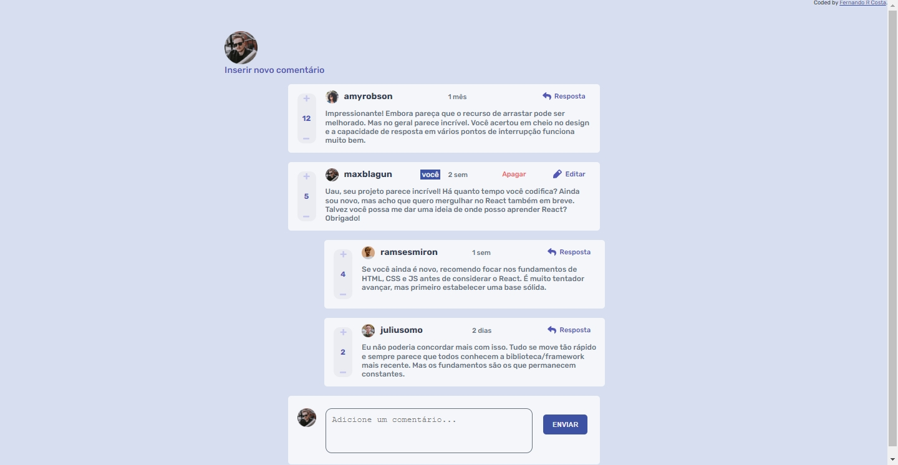
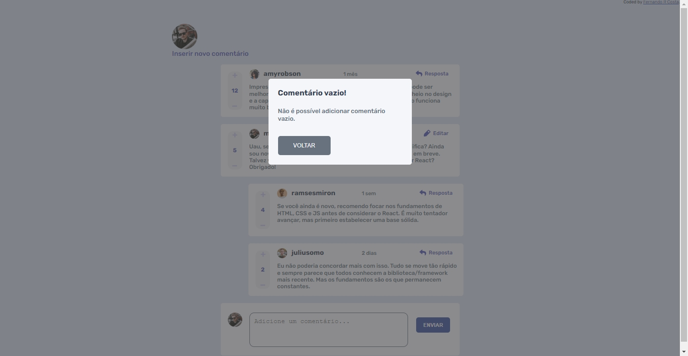
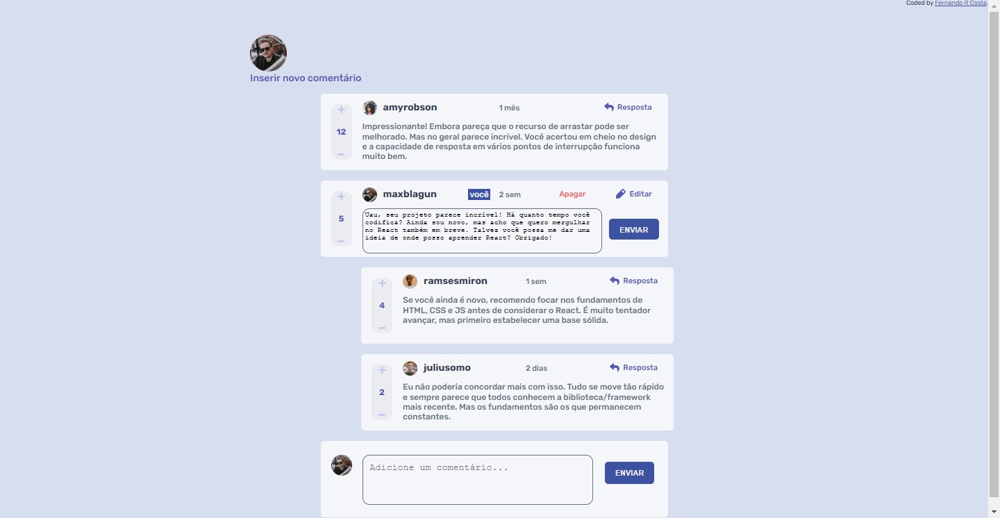
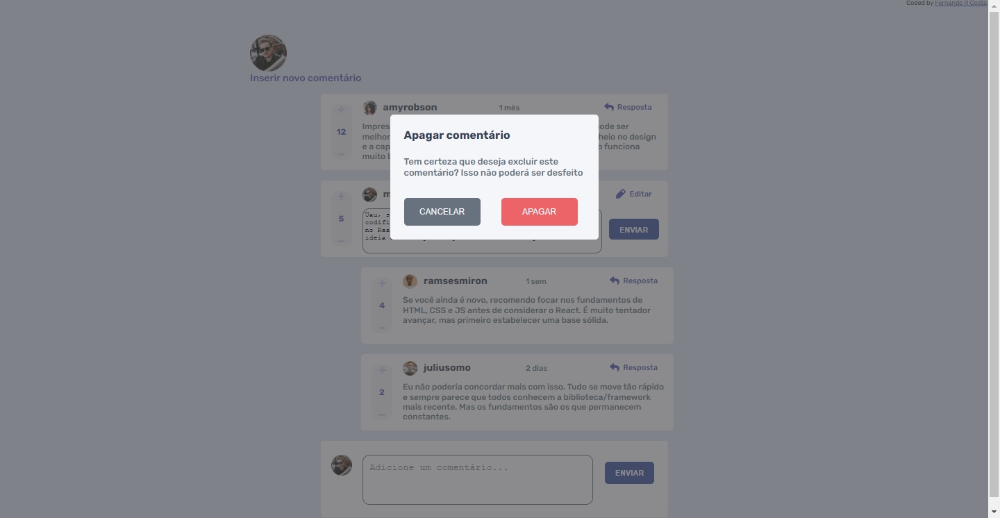
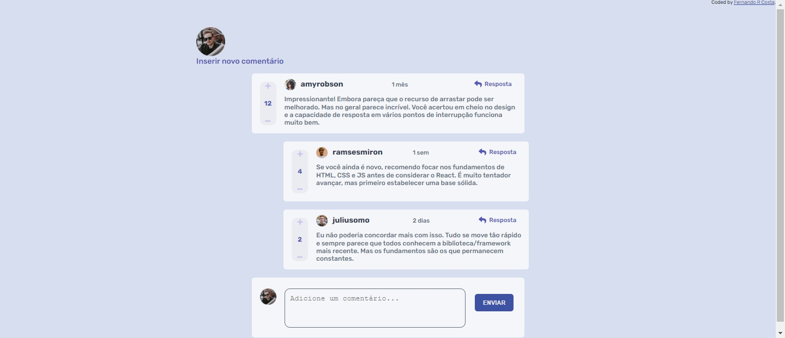
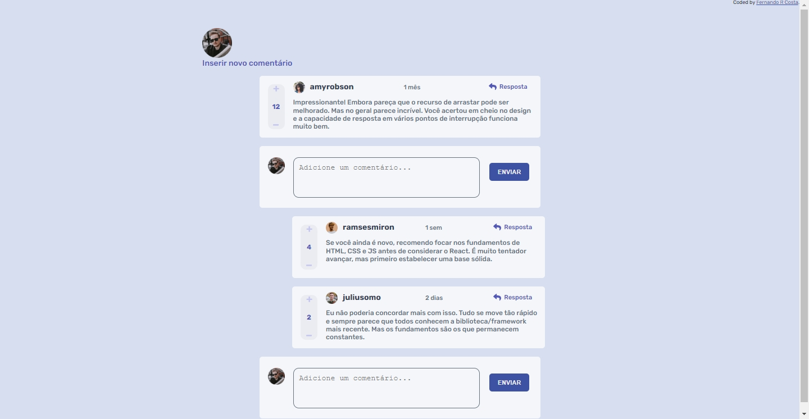
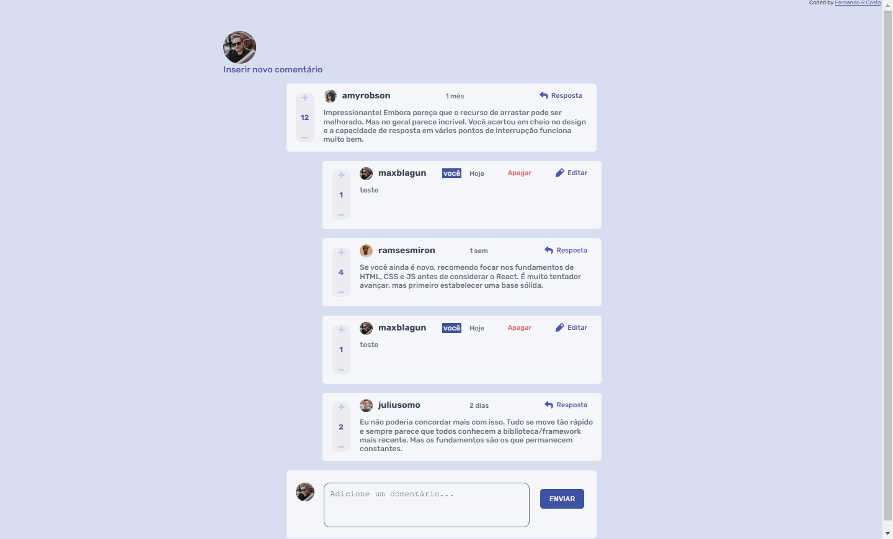
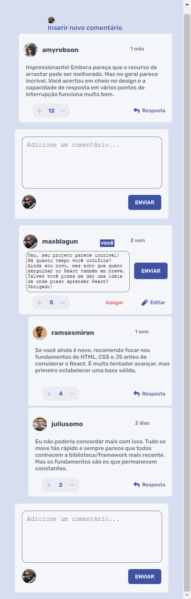

# Solução de seção de comentários interativos

## Índice

- [Visão Geral](#visão-geral)
  - [O Desafio](#o-desafio)
  - [Screenshot](#screenshot)
  - [Links](#links)
- [Meu processo](#meu-processo)
- [Autor](#autor)

## Visão Geral

### O Desafio

Os usuários deverão ter a capacidade de:

- Visualizar o layout ideal para o site, dependendo do tamanho da tela do dispositivo;
- Ver os estados de foco para todos os elementos interativos na página;
- Criar, ler, atualizar e excluir comentários e respostas;
- Comentários positivos e negativos;

### Screenshot

### Links

- Site URL: [Seção de comentários](https://interactive-comments-section-three-black.vercel.app/)

## Meu processo

- Parte 1 Frontend
- [x] Desktop-design
- [x] Desktop-modal
- [x] Mobile-design
- [x] Mobile-modal
- [x] Estado-ativos
- [x] Buscar-dados

- Parte 2 Fullstack
- [x] Interação-postar
- [x] Interação-erro-comentario
- [x] Interação-responder
- [x] Interação-positivo-negativo
- [x] Interação-usuario
- [x] Interação-editar
- [x] Interação-deletar
- [x] Refatorar

## Autor

- LinkedIn - [Fernando R Costa](https://www.linkedin.com/in/fernando-r-costa/)